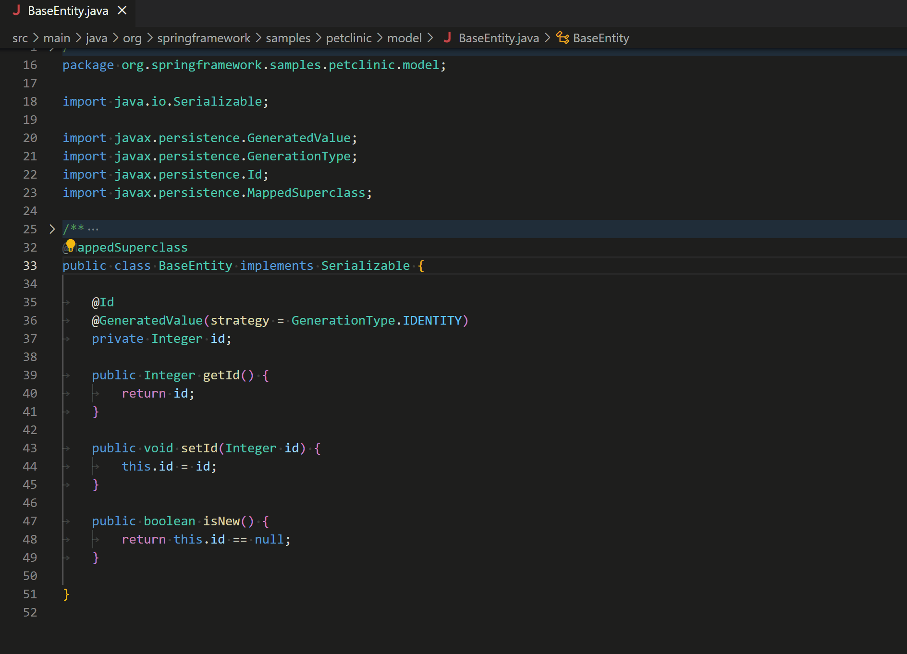

#    vscode-lombok

## Overview

https://marketplace.visualstudio.com/items?itemName=GabrielBB.vscode-lombok

A lightweight extension to support [Lombok](https://projectlombok.org/) annotations processing in Visual Studio Code

## Requirements
- VS Code (version 1.21.0 or later)
- Lombok added as a dependency in your Java Project (Make sure you're using the latest version to avoid issues!) [Add with Maven](https://projectlombok.org/setup/maven) or  [Add with Gradle](https://projectlombok.org/setup/gradle)

## Install

Open VS Code and press `Ctrl + Shift + X` to open extension manager. Type `lombok` and click install. Reload VS Code when asked.

## Features / Supports

- [@Getter and @Setter](http://projectlombok.org/features/GetterSetter.html)
- [@ToString](http://projectlombok.org/features/ToString.html)
- [@EqualsAndHashCode](http://projectlombok.org/features/EqualsAndHashCode.html)
- [@AllArgsConstructor, @RequiredArgsConstructor and @NoArgsConstructor](http://projectlombok.org/features/Constructor.html)
- [@Log](http://projectlombok.org/features/Log.html)
- [@Slf4j](https://projectlombok.org/features/log)
- [@Data](https://projectlombok.org/features/Data.html)
- [@Builder](https://projectlombok.org/features/Builder.html)
- [@Singular](https://projectlombok.org/features/Builder.html#singular)
- [@Delegate](https://projectlombok.org/features/Delegate.html)
- [@Value](https://projectlombok.org/features/Value.html)
- [@Accessors](https://projectlombok.org/features/experimental/Accessors.html)
- [@Wither](https://projectlombok.org/features/experimental/Wither.html)
- [@SneakyThrows](https://projectlombok.org/features/SneakyThrows.html)
- [@val](https://projectlombok.org/features/val.html)
- [@UtilityClass](https://projectlombok.org/features/experimental/UtilityClass.html)

## Credits
This project was originally started by [@GabrielBB](https://github.com/GabrielBB) and is now currently maintained by Microsoft. Huge thanks to [@GabrielBB](https://github.com/GabrielBB) who started it all and made this Lombok extension available.

[I'm having issues](https://github.com/Microsoft/vscode-lombok/issues)
